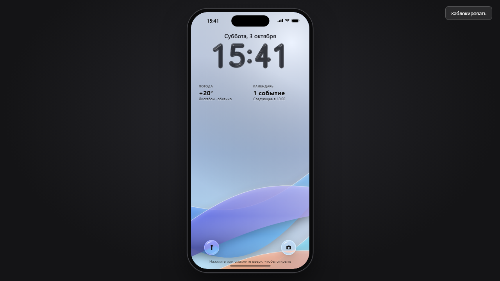
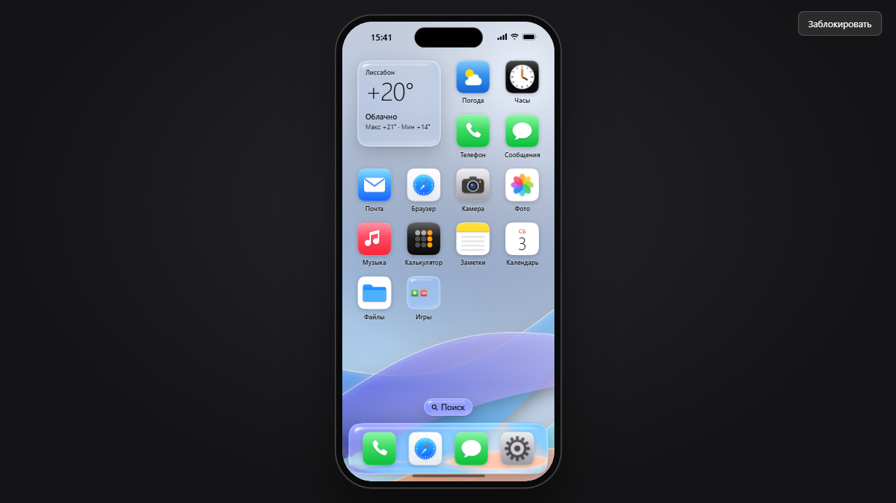
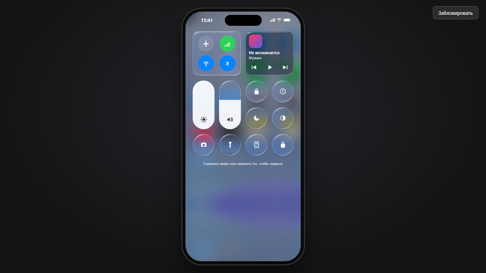

# iOSDemo - the "Glass" phone

**English** · [Русский](README.ru.md)

A phone in the style of iOS 26 that runs entirely in the browser: lock screen, home screen,
Control Center, Notification Center, an app switcher and fourteen working apps, all under a
liquid glass look. No server, no internet, no images or fonts from the original system:
icons and wallpapers are drawn by code in this repository.

**[▶ Open online](https://alexalesha.github.io/iOSDemo/)**

> Fan-made interface concept. Not affiliated with or endorsed by Apple. iOS is a trademark or
> registered trademark of Cisco in the U.S. and other countries and is used under licence by
> Apple; iPhone is a trademark of Apple Inc.

The interface is in Russian.







## What it does

- **Glass:** the refracting glass of the dock, widgets, folders and Control Center uses the
  technique of [LiquidGlass](https://github.com/ALEXalesha/LiquidGlass); six wallpapers are
  painted on a canvas; light and dark themes.
- **Gestures follow the pointer:** swipe up from the bottom bar to go home (or click the bar, or
  press Esc), swipe up and hold for the app switcher (cards scroll sideways), pull down from the
  top left for Notification Center and from the top right for Control Center.
- **Apps:** Phone, Messages, Mail, Browser (built-in pages), Camera, Photos, Music (synthesised
  melodies), Weather, Clock (world clock, alarms, stopwatch), Calculator, Notes, Calendar,
  Settings, Files (kept in the browser, IndexedDB), plus a Games folder.
- **Games:** Cube World ([AlexMine](https://github.com/ALEXalesha/AlexMine)) and Horizon Drift
  ([HorizonDrift](https://github.com/ALEXalesha/HorizonDrift)) open full screen. They are
  separate repositories: on GitHub Pages the phone loads `../../AlexMine/` and
  `../../HorizonDrift/` of the same site. Locally, clone them next to this repository.
  A game is paused when you go home (the protocol is in `_os-shared/README.md`).
- Settings, wallpaper, notes, alarms, events, chats and photos are saved.

The page lives in `ios26/`; it is built from `ios26/src/` by `node ios26/src/build.js`. The root
`index.html` just opens it.

## Run locally

Open `index.html` or `ios26/index.html` in Chrome or Edge.

## Tests

Playwright laws in `tests/` open the page by its file address in headless Chromium, one at a time:

```
npm install
npx playwright install chromium
npm test
```

Mouse capture in the tests is always a stub. `npm run screenshots` makes the pictures above.

## History

The phone was made in the MixOfProject collection (folders `web/ios26` and `web/_os-shared`).
This repository carries it with its commit history, starting from the commit that removed other
companies' names and marks from the first draft; the start page, the games table for two
separately published games and the tests were added for this publication.

## Licence

MIT, see [LICENSE](LICENSE).
